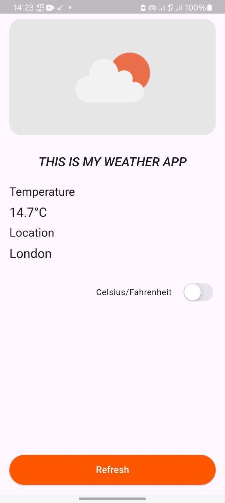

# Weather App 🌦️

A Flutter weather application demonstrating Clean Architecture and BLoC state management, integrated with the OpenWeatherMap API.

## Features
- Current weather display for a default location
- Temperature unit toggle (°C/°F)
- Error handling with retry mechanism
- Auto-refresh capability
- Clean UI with responsive design

## Prerequisites
- Flutter SDK 3.0+
- OpenWeatherMap API key (free tier)

## Getting Started

1. **Clone the repository**
   ```bash
   git clone https://github.com/ETdvlpr/Weather-App.git
   ```

2. **Install dependencies**
   ```bash
   flutter pub get
   ```

3. **Setup environment**
   - Create `.env` file in root directory similar to `.env.example`.
   - Add your API key:
     ```env
     API_KEY=your_openweathermap_api_key
     ```

4. **Run the app**
   ```bash
   flutter run
   ```

## Project Structure
```
lib/
├── core/
│   └── injection_container.dart    # Dependency injection setup
├── data/
│   ├── datasources/                # Remote data sources
│   └── repositories/               # Repository implementations
├── domain/
│   ├── entities/                   # Business objects
│   └── repositories/               # Abstract repository contracts
├── presentation/
│   ├── bloc/                       # BLoC components
│   ├── screens/                    # UI screens
│   └── widgets/                    # Reusable components
└── util/
    └── constants.dart              # App constants
```

## Screenshots
### Home Screen


### Video Demo

<video width="640" height="360" controls>
   <source src="screenshot/video.mp4" type="video/mp4">
   Your browser does not support the video tag.
</video>

## Dependencies
- **bloc**: State management
- **dio**: HTTP client
- **equatable**: Value comparison
- **flutter_dotenv**: Environment variables
- **get_it**: Dependency injection
